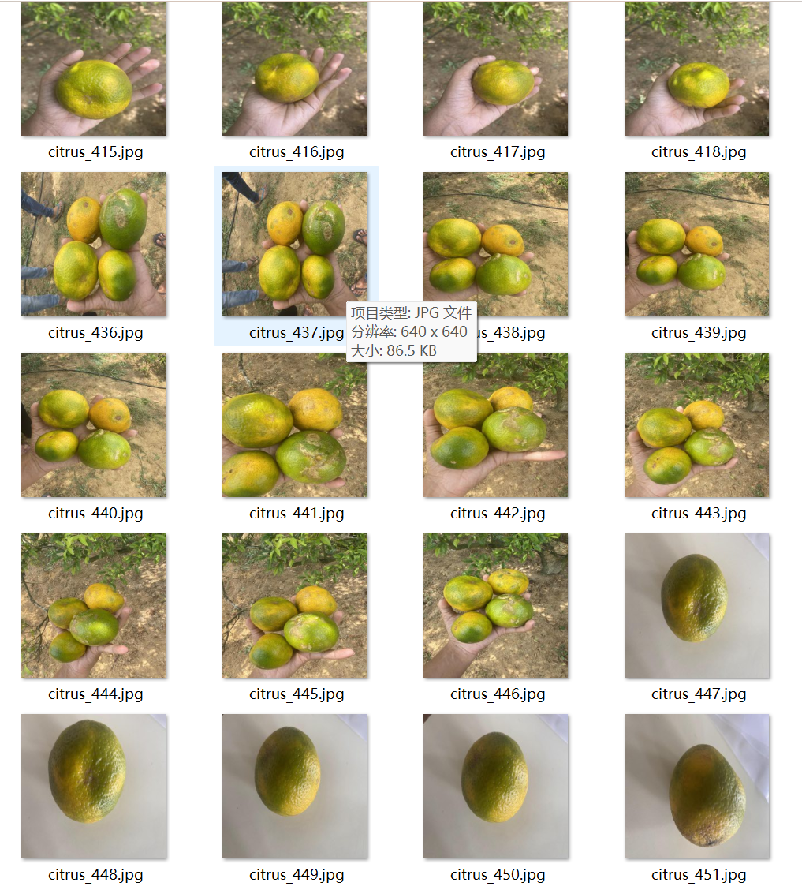
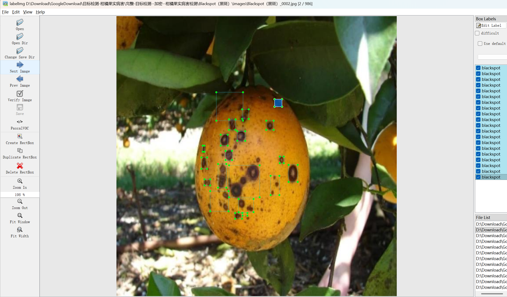
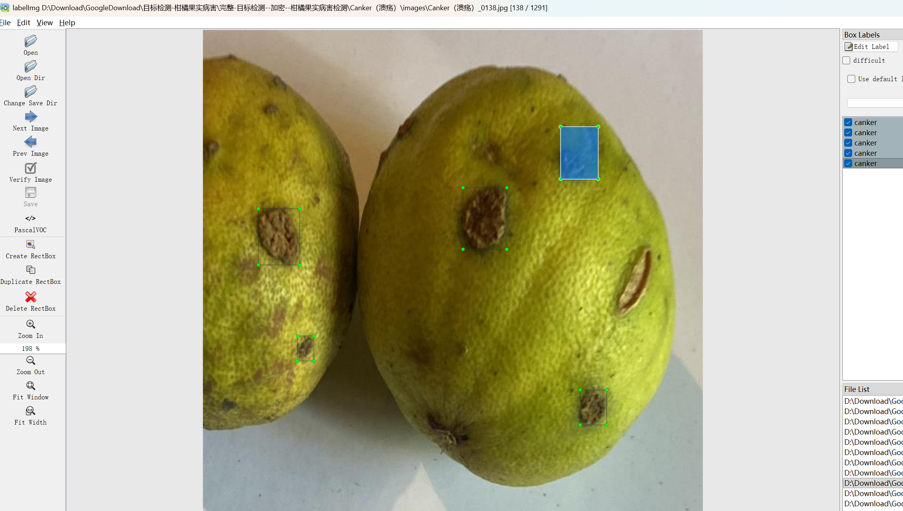
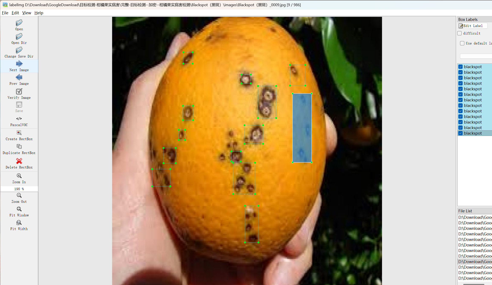

# Citrus Fruit Disease Detection Dataset

Dataset Information Introduction: The dataset consists of 4834 images, each paired with a corresponding annotation file. The annotation files are available in two formats: VOC (xml) and YOLO (txt). The objects annotated include:
- blackspot
- canker
- greening
- healthy

The number of annotation boxes is as follows: (Annotations are usually written in English, but the Chinese names provided in parentheses are for reference)

Note: An image may contain multiple objects, so the total number of annotation boxes might exceed the number of images.

The complete dataset includes four disease folders, each containing three folders and a txt file:
- images: Stores the dataset's images, screenshots included:

Image size information:
- all_txt: Contains the txt annotation files in yolo format, each annotation file is one-to-one with the image.
- classes.txt: Stores the txt annotation files in yolo format, the number matches the image count, and each annotation file corresponds to one specific object in the array at index 0.
- all_xml: A VOC (xml) annotation file. The number matches the image count, each annotation file corresponds to one specific object in the array at index 0.
- How to read detailed VOC standard files, please refer to your own search results. In short, the number 0 represents the name of the object in the array at index 0 in the classes.txt file.

Both formats of annotation are usable; choose either one based on your preference.

Annotation effect screenshots:

## Images

Here is a pay link on Stripe ( https://buy.stripe.com/3cs8yP7sY87d0vu9AB ). Please contact me lonlonago@foxmail.com after funding $89, and I will send you a complete data files , thank you!

